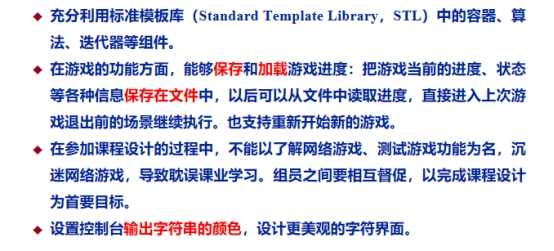

# 游戏设计文档：终端回合制RPG - 实现版本

## 游戏名称

重返崂山!

## 核心玩法 ✅ 已实现

- 玩家与敌人进行回合制战斗
- 玩家在自己的回合可以选择：
  - **普通攻击**: 对敌人造成基础伤害，10%暴击几率
  - **技能攻击**: 使用一次性技能，造成更高伤害或治疗效果
  - **道具使用**: 使用血瓶、炸弹等战斗道具
  - **逃跑**: 70%成功率逃离战斗
- 战斗模式类似于《宝可梦》的回合制系统

## 游戏目标 ✅ 已实现

- 探索ASCII艺术风格的3x7地图
- 击败15只普通敌怪获得足够实力
- 挑战并击败强大的崂山龙王BOSS取得最终胜利

## 主要特性 ✅ 已实现

### 💀 敌人系统
- 多种敌人类型：史莱姆、哥布林、骷髅兵、兽人、龙王BOSS
- 击败敌人获得经验值、金币和技能奖励
- 每个敌人有独特的AI行为模式

### 🗺️ 地图系统
- **ASCII艺术地图**: 精美的字符艺术地图显示
- **房间类型**:
  - **起始房** (/▲\): 安全的出发点
  - **怪物房** (/♠\): 遭遇敌人触发战斗，清理后显示╳╳╳
  - **商店房** (┌$┐): 购买技能和道具
  - **休息房** (☾): 一次性完全恢复生命值
  - **BOSS房** (☠): 最终挑战龙王
- **迷雾系统**: 未访问房间显示为░?░，增加探索乐趣

### ⚔️ 技能系统 
- **一次性使用**: 所有技能使用后消失，增加策略性
- **无MP消耗**: 简化了资源管理
- 玩家最多可持有10个技能
- **初始技能**: 开局获得3个随机技能
- **获得途径**: 战斗奖励、商店购买

### 🎒 道具系统
- **小血瓶**: 恢复30HP，价格20金币
- **炸弹**: 战斗中对敌人造成50点直接伤害，价格80金币  
- **道具背包**: 最多携带8个道具
- 支持战斗中和非战斗状态下使用

### 💰 经济系统
- 击败敌人获得金币奖励
- 商店购买技能和道具
- 起始金币：100

### 📈 升级系统
- 通过战斗获得经验值
- 每级所需经验值: level × 100
- 升级属性提升: HP+20, 攻击+3, 防御+2

## 详细游戏设计 - 当前实现

### 角色属性系统 ✅ 已实现
- **玩家初始属性**:
  - 生命值: 100 HP
  - 攻击力: 15
  - 防御力: 5
  - ~~蓝量: 50 MP~~ (已移除)
  - 经验值: 0 EXP
  - 等级: 1
  - 金币: 100

- **升级系统**:
  - 每级所需经验值: level × 100
  - 升级时属性提升: HP+20, 攻击+3, 防御+2
  - ~~MP+10~~ (已移除MP系统)

### 敌人设计 ✅ 已实现
- **史莱姆** (普通): HP=30, 攻击=8, 防御=2, 经验=25, 金币=15
- **哥布林** (普通): HP=45, 攻击=12, 防御=3, 经验=35, 金币=25  
- **骷髅兵** (普通): HP=55, 攻击=15, 防御=5, 经验=45, 金币=30
- **兽人** (精英): HP=80, 攻击=20, 防御=8, 经验=70, 金币=50
- **崂山龙王** (BOSS): HP=300, 攻击=35, 防御=15, 经验=200, 金币=200

### 技能系统设计 ✅ 已实现
#### 攻击技能:
- **火球术**: 伤害=攻击力×1.5 ~~消耗MP=15~~ (无消耗)
- **冰锥**: 伤害=攻击力×1.3 ~~消耗MP=12~~ (无消耗)  
- **雷击**: 伤害=攻击力×1.8 ~~消耗MP=20~~ (无消耗)
- **剑气斩**: 伤害=攻击力×2.0 ~~消耗MP=25~~ (无消耗)

#### 治疗技能:
- **治疗术**: 恢复HP=50 ~~消耗MP=20~~ (无消耗)
- **大治疗术**: 恢复HP=100 (无消耗)

### 地图设计 ✅ 已实现  
- **总房间数**: 21个房间 (3×7网格布局)
- **ASCII艺术显示**: 每个房间都有独特的视觉符号
- **房间分布**:
  - 起始房: 1个 (左上角)
  - 怪物房: ~15个 (随机分布)
  - 商店房: 3个 (随机分布) 
  - 休息房: 1个 (随机分布)
  - BOSS房: 1个 (右下角)
- **移动系统**: W/A/S/D四方向移动，边界检测

### 战斗系统 ✅ 已实现
- **伤害计算**: 最终伤害 = max(1, 攻击力 - 防御力)
- **暴击系统**: 10%几率造成1.5倍伤害
- **回合顺序**: 玩家先手行动
- **战斗选项**: 普通攻击、技能、道具、逃跑
- **逃跑机制**: 70%成功率，失败继续战斗
- **胜利条件**: 敌人HP降为0
- **失败条件**: 玩家HP降为0

### 商店系统 ✅ 已实现
- **随机技能**: 100金币购买随机技能
- **小血瓶**: 恢复30HP，价格20金币
- **炸弹**: 战斗道具，造成80点伤害，价格80金币
- 背包容量检查和金币验证

### 界面系统 ✅ 已实现

#### 固定界面布局:
- **顶部**: 玩家状态信息 (生命值条、等级、经验、金币)
- **中部**: ASCII艺术地图 (带图例和状态信息)
- **底部**: 操作控制说明

#### 输入控制:
**地图探索**:
- W/A/S/D: 四方向移动
- M: 显示地图
- P: 显示玩家状态  
- I: 查看技能背包
- B: 查看道具背包
- H: 帮助说明
- C: 清屏刷新
- Q: 退出游戏菜单
- X: 手动保存游戏

**战斗界面**:
- 1: 普通攻击
- 2: 使用技能 (进入技能选择菜单)
- 3: 使用道具 (进入道具选择菜单) 
- 4: 尝试逃跑

### 存档系统 ✅ 已实现
- **自动保存**: 游戏进度自动保存
- **手动保存**: 按X键手动保存
- **断点继续**: 支持从存档点继续游戏
- **存档管理**: 主菜单提供存档删除选项

### 中文支持 ✅ 已实现  
- **UTF-8编码**: 完整支持中文显示
- **中文输入**: 支持中文角色姓名输入
- **控制台设置**: 自动配置Windows控制台编码

## 技术实现

### 编译环境
- **编译器**: MinGW-w64 g++ 13.2.0
- **C++标准**: C++17
- **静态链接**: 无需额外DLL文件
- **编译输出**: game_latest.exe

### 核心类设计 - 实际实现

#### 1. Character (角色基类) ✅
```cpp
class Character {
protected:
    int hp, maxHP, attack, defense, level;
    string name;
public:
    virtual void takeDamage(int damage);
    virtual int dealDamage() const;
    virtual bool isAlive() const;
    virtual void displayStats() const = 0;
};
```

#### 2. Player (玩家类) ✅  
```cpp
class Player : public Character {
private:
    int exp, gold;
    vector<Skill*> skills;      // 技能列表，使用后删除
    vector<Item*> inventory;    // 道具背包  
    static const int MAX_SKILLS = 10;
    static const int MAX_ITEMS = 8;
public:
    void gainExp(int amount);
    void levelUp();
    bool addSkill(Skill* skill);
    bool useSkill(int index, Character& target);  // 一次性使用
    bool addItem(Item* item);
    bool useItem(int index);
    bool useItemInBattle(int index, Character& enemy);
    void displayStats() const override;
    void displaySkillBag() const;
    void displayInventory() const;
    void restoreToFullHP();
};
```

#### 3. Battle (战斗类) ✅
```cpp  
class Battle {
private:
    Player* player;
    Enemy* enemy;
    bool battleEnded;
    bool playerWon;
    bool playerEscaped;  // 区分逃跑和死亡
    vector<DropItem> battleRewards;
public:
    bool startBattle();
    bool handleAttack();
    bool handleSkillUse();
    bool handleItemUse(); 
    bool handleEscape();
    void handleVictory();
    void handleDefeat();
    bool didPlayerEscape() const;
};
```

#### 4. AsciiMapRenderer (地图渲染) ✅
```cpp
class AsciiMapRenderer {
public:
    static void displayAsciiMap(Room* const rooms[HEIGHT][WIDTH], 
                               int playerX, int playerY, int monstersDefeated);
private:
    static void generateRoomAscii(RoomAscii& ascii, Room* room, bool hasPlayer);
    static void generateStartRoom(RoomAscii& ascii, bool hasPlayer);
    static void generateMonsterRoom(RoomAscii& ascii, bool hasPlayer, bool cleared);
    static void generateShopRoom(RoomAscii& ascii, bool hasPlayer);
    static void generateEmptyRoom(RoomAscii& ascii, bool hasPlayer);
    static void generateBossRoom(RoomAscii& ascii, bool hasPlayer);
};
```

#### 5. Game (游戏主控制) ✅
```cpp
class Game {
private:
    Player* player;
    Map* gameMap; 
    bool gameRunning;
    bool gameWon;
public:
    void run();
    void gameLoop();
    void displayGameInterface();  // 固定布局界面
    void handleMovement(char direction);
    void handleRoomEntry();
    void handleShop();
    void showStartMenu();
    bool startNewGame();
    bool loadGame();
};
```

### 设计模式应用 ✅
- **工厂模式**: SkillFactory, EnemyFactory, ItemFactory 创建游戏对象
- **单例模式**: Colors 颜色管理类
- **策略模式**: 不同房间类型的处理策略
- **状态模式**: 游戏状态管理 (菜单、游戏中、战斗等)

## 游戏特色

### 🎨 视觉设计
- **ASCII艺术风格**: 复古终端美学
- **彩色界面**: 使用ANSI颜色codes增强视觉效果
- **清晰布局**: 固定三段式界面布局
- **动态更新**: 实时刷新地图和状态信息

### 🎮 游戏体验  
- **即时输入**: getch()实现无需回车的快速操作
- **策略深度**: 一次性技能系统要求合理规划资源
- **探索乐趣**: 迷雾系统和随机地图布局
- **成就感**: 清晰的进度指示和奖励反馈

### 🔧 技术特色
- **跨平台兼容**: 支持Windows/Linux控制台
- **内存安全**: RAII和智能指针模式
- **模块化设计**: 高内聚低耦合的类结构
- **扩展性强**: 工厂模式便于添加新内容

## 平衡性分析 - 实测数据

### 战斗难度曲线 ✅
- **前期** (1-5只怪): 史莱姆为主，建立信心
- **中期** (6-10只怪): 哥布林、骷髅兵混合，需要技能配合  
- **后期** (11-15只怪): 精英兽人出现，考验策略运用
- **BOSS战**: 龙王超高血量，需要充分准备和技能储备

### 经济平衡 ✅  
- 击败15只普通敌人平均获得: ~400金币
- 商店核心物品成本: 技能100+血瓶60+炸弹80 = 240金币
- 有余量购买多个道具，但需要做选择

### 技能获取策略 ✅
- 开局3技能 + 战斗掉落 + 商店购买 = 约8-12个技能获得机会
- 10个技能上限迫使优化技能组合
- 一次性使用增加每次战斗的决策深度

## 部署说明

### 编译方法
```bash  
g++ -std=c++17 -Wall -Wextra -O2 -static-libgcc -static-libstdc++ -o game_latest.exe main.cpp Colors.cpp Item.cpp
```

### 运行要求
- Windows 10+ 或 Linux 系统
- 支持UTF-8的控制台环境  
- 约1MB磁盘空间

### 文件结构
```
claudecode/
├── game_latest.exe     # 主程序
├── compile.bat         # 编译脚本
├── game_save.txt       # 存档文件(自动生成)
├── main.cpp           # 程序入口
├── Colors.cpp         # 颜色系统实现
├── Item.cpp           # 道具系统实现  
└── 各种.h头文件       # 类定义
```

---

**🎮 《重返崂山》- 一个完整实现的终端RPG游戏**

*特色: ASCII艺术 | 回合制战斗 | 策略技能 | 中文支持*

## 详细类设计 (V2)

### 核心类结构

#### 1. Character (角色基类)
```cpp
class Character {
protected:
    int hp, maxHP, attack, defense, level;
    string name;
public:
    virtual void takeDamage(int damage);
    virtual int dealDamage() const;
    virtual bool isAlive() const;
    // 纯虚函数，子类必须实现
    virtual void displayStats() const = 0;
};
```

#### 2. Player (玩家类)
```cpp
class Player : public Character {
private:
    int mp, maxMP, exp, gold;
    vector<Skill*> skills;      // 技能列表
    vector<Item*> inventory;    // 道具背包
    int skillCount = 0;         // 当前技能数量
    
public:
    void gainExp(int amount);
    void levelUp();
    bool addSkill(Skill* skill);  // 返回是否成功添加
    bool useSkill(int index, Character& target);
    void useItem(int index);
    void displayStats() const override;
    void displaySkills() const;
    void displayInventory() const;
};
```

#### 3. Enemy (敌人类)
```cpp
class Enemy : public Character {
private:
    int expReward, goldReward;
    string enemyType;           // "slime", "goblin", "skeleton", "orc", "boss"
    Skill* dropSkill;           // 可能掉落的技能
    
public:
    Enemy(string type);         // 构造函数根据类型初始化属性
    void displayStats() const override;
    int getExpReward() const { return expReward; }
    int getGoldReward() const { return goldReward; }
    Skill* getDropSkill() const { return dropSkill; }
    string getType() const { return enemyType; }
};
```

#### 4. Skill (技能类)
```cpp
class Skill {
private:
    string name;
    int damage;        // 伤害倍率 (例如150表示1.5倍攻击力)
    int mpCost;        // 蓝量消耗
    string effect;     // 特殊效果 ("none", "freeze", "heal", "buff_atk", "buff_def")
    int effectValue;   // 效果数值
    
public:
    Skill(string n, int dmg, int cost, string eff = "none", int val = 0);
    int calculateDamage(int userAttack) const;
    bool canUse(int currentMP) const;
    void applyEffect(Character& target) const;
    string getName() const { return name; }
    int getMPCost() const { return mpCost; }
    void displayInfo() const;
};
```

#### 5. Item (道具类)
```cpp
class Item {
private:
    string name;
    string type;        // "heal", "mana", "buff"
    int value;          // 恢复量或效果值
    int price;          // 商店价格
    
public:
    Item(string n, string t, int v, int p);
    void use(Player& player) const;
    string getName() const { return name; }
    int getPrice() const { return price; }
    void displayInfo() const;
};
```

#### 6. Room (房间类)
```cpp
enum class RoomType { MONSTER, SHOP, EMPTY, BOSS };

class Room {
private:
    RoomType type;
    bool visited;
    bool cleared;               // 是否已清理完毕
    Enemy* monster;             // 房间内的怪物 (如果是怪物房)
    vector<Item*> shopItems;    // 商店物品 (如果是商店房)
    vector<Skill*> shopSkills;  // 商店技能
    
public:
    Room(RoomType t);
    ~Room();
    void enter(Player& player); // 进入房间触发的事件
    RoomType getType() const { return type; }
    bool isCleared() const { return cleared; }
    void displayRoomInfo() const;
};
```

#### 7. Map (地图类)
```cpp
class Map {
private:
    static const int WIDTH = 7;
    static const int HEIGHT = 3;
    Room* rooms[HEIGHT][WIDTH];
    int playerX, playerY;       // 玩家当前位置
    int monstersDefeated;       // 已击败的怪物数量
    
public:
    Map();
    ~Map();
    void generateMap();         // 随机生成地图布局
    bool movePlayer(char direction); // w,a,s,d移动
    void displayMap() const;    // 显示地图概览
    Room* getCurrentRoom();
    bool canMove(char direction) const;
    int getMonstersDefeated() const { return monstersDefeated; }
    void incrementMonstersDefeated() { monstersDefeated++; }
};
```

#### 8. Battle (战斗类)
```cpp
class Battle {
private:
    Player* player;
    Enemy* enemy;
    bool playerTurn;
    
public:
    Battle(Player* p, Enemy* e);
    void startBattle();
    void playerAction();        // 处理玩家回合
    void enemyAction();         // 处理敌人回合
    bool isBattleOver() const;
    bool playerWon() const;
    void displayBattleStatus() const;
    int calculateDamage(int attack, int defense) const;
};
```

#### 9. Game (游戏主控制类)
```cpp
class Game {
private:
    Player* player;
    Map* gameMap;
    bool gameRunning;
    bool gameWon;
    
    // UI相关方法
    void displayMainMenu();
    void displayPlayerInfo() const;
    char getPlayerInput();
    void clearScreen();
    void waitForInput();
    
    // 游戏逻辑方法
    void initializeGame();
    void gameLoop();
    void handleMovement();
    void handleRoomEntry();
    void checkWinCondition();
    
public:
    Game();
    ~Game();
    void run();                 // 游戏主入口
    void endGame(bool won);
};
```

### 类关系说明
- **继承关系**: Player, Enemy 继承自 Character
- **组合关系**: Game 包含 Player 和 Map; Player 包含 Skill 和 Item 列表
- **依赖关系**: Battle 依赖 Player 和 Enemy; Room 依赖 Enemy, Item, Skill
- **聚合关系**: Map 包含 Room 数组

### 设计模式应用
- **工厂模式**: Enemy构造函数根据类型创建不同属性的敌人
- **策略模式**: Skill类的不同效果类型
- **状态模式**: Game类的不同游戏状态处理

## 初步的类设计 (V1)

- **`Character` (角色基类)**: 存放玩家和敌人共有的属性（如生命值、攻击力、防御力）。这是一个抽象的"生物"概念。
- **`Player` (玩家类)**: 继承自 `Character`，包含玩家特有的属性（如技能列表、经验值、蓝量）。
- **`Enemy` (敌人类)**: 继承自 `Character`，包含敌人特有的属性（如怪物种类、掉落物）。
- **`Skill` (技能类)**: 描述一个技能的属性（如名称、伤害值、所需蓝量）。
- **`Room` (房间类)**: 描述一个房间的类型（怪物房/技能房）和内容（里面有什么敌人或技能）。
- **`Map` (地图类)**: 管理所有的 `Room` 对象以及玩家在地图上的位置。
- **`Game` (游戏主类)**: 负责整个游戏的主循环、处理玩家输入、控制战斗流程和判断游戏胜负。这个类是整个游戏的“大脑”。

## 交互与界面要求 (UI/UX)

- **状态显示**: 玩家信息居左，敌人信息居右，在一行内并排显示，界面清晰。

- **即时输入**: 玩家通过按键直接选择操作，无需按回车确认，提升操作感。

- **回合制节奏**: 每个完整回合结束后，游戏暂停并显示分割线，等待玩家按任意键后继续，避免信息滚动过快。

- 项目要求：

   

- 游戏扩展性需求

  - 可自定义添加技能 - 你希望以后能轻松添加更多技能
  - 可自定义添加敌人 - 你希望能添加新的敌人类型
  - 可自定义敌人掉落 - 你希望能自定义敌人爆什么东西

  🎨 界面体验需求

  - 更长的分割线 - 让界面层次更清晰
  - 减少视觉混乱 - 避免信息过多造成眼花缭乱
  - 彩色界面设计 - 用颜色让界面更美观清晰
  - 自动刷新地图 - 战斗后自动显示更新的地图，不用往上翻找

  🔧 设计原则

  基于你的需求，我在代码设计中确保了：
  1. 模块化结构 - 每个系统独立，便于扩展
  2. 数据驱动 - 敌人、技能、掉落物可通过配置轻松添加
  3. 用户体验优先 - 界面清晰，操作流畅
  4. 扩展性强 - 为未来功能预留接口