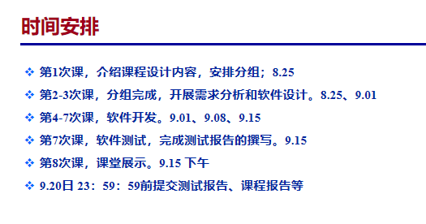
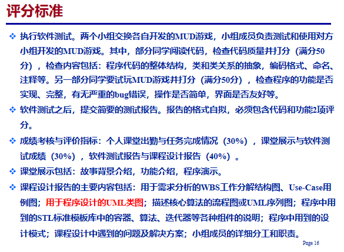
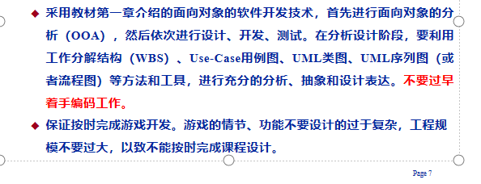

C++课设

**课堂展示包括**：故事背景介绍，功能介绍，程序演示。

**课程设计报告的主要内容包括**：用于需求分析的WBS工作分解结构图、Use-Case用例图；用于程序设计的UML类图；描述核心算法的流程图或UML序列图；程序中用到的STL标准模板库中的容器、算法、迭代器等各种组件的说明；程序中用到的设计模式；课程设计中遇到的问题及解决方案；小组成员的详细分工和职责。

**软件测试**之后，提交简要的测试报告。报告的格式自拟，必须包含代码和功能2项评分。

**开展需求分析和软件设计**-首先进行面向对象的分析（OOA），然后依次进行设计、开发、测试。在分析设计阶段，要利用工作分解结构（WBS）、Use-Case用例图、UML类图、UML序列图（或者流程图）等方法和工具，进行充分的分析、抽象和设计表达。不要过早着手编码工作。

**保证按时完成游戏开发**。游戏的情节、功能不要设计的过于复杂，工程规模不要过大，以致不能按时完成课程设计。

