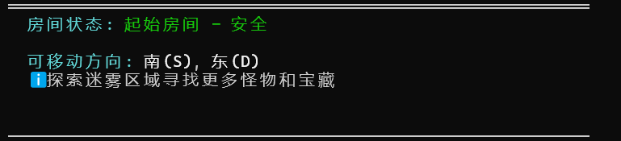

请解决以下问题：

1. 输入名称时，如果输入的时中文，如“小刘”会出现乱码 ，以及在战斗时还是显示”“勇者”应该显示玩家输入的名称，以后的所有称呼都得改成玩家输入的名称

2. 以及在一开始的地图中没有显示玩家的位置，玩家可以初始在地图的左上角

3. 请完善道具系统

4. 击败完怪物后，不需要再按任意键继续了就直接请输入指令就行

5. 休息房只在第一次进入时才可以恢复血量（直接把血量恢复成满血就行），重复进入不会有任何效果

6. 我希望每移动一次地图就能重新刷新一下，每次移动都伴随着清屏，然后地图始终是固定在某个位置，然后还是按照原来的那种房间的描述就行。

7. 地图有显示bug，商店的显示有问题

   

解决以下的问题：

1. 一开始的地图中没有显示玩家的位置，玩家可以初始在地图的左上角
2. 成功逃跑后不用输出游戏结束和战斗失败和我被某某某击败了 只需输出你成功逃离了战斗，以及逃跑成功后按任意键，清屏并且打印地图界面那些信息
3. 操作说明一直固定在地图的下方，玩家的状态一直固定在地图的上面
4. 击败怪物后还是需要按任意键继续，因为要查看怪物的掉落物啥的

解决以下问题：

删除原来的技能并且添加以下技能：

1. **技能名称：致死打击 (Execute)**

   

   - **技能描述：** 一次强力的攻击，对生命值较低的敌人造成毁灭性打击。
   - **伤害比例：** 基础伤害为80%。敌人的生命值每降低1%，此技能的伤害比例就额外增加2%。例如，如果敌人只剩30%的生命值，那么伤害比例就是 80% + ( (100-30) * 2% ) = 220%。

- 
- **技能名称：生命吸取 (Life Siphon)**
  - 
  - **技能描述：** 攻击敌人，将一部分伤害转化为自己的生命值。
  - **伤害比例：** 对目标造成110%的基础伤害，并将造成伤害的50%转化为治疗量治疗自己。

- 
- **技能名称：复仇 (Revenge)**
  - 
  - **技能描述：** 当角色生命值低于一定程度时才能使用的强力反击技能。
  - **伤害比例：** 只有当自身生命值低于40%时才能发动。造成250%的基础伤害。

- 
- **技能名称：死亡标记 (Marked for Death)**
  - 
  - **技能描述：** 给一个敌人施加一个标记，在标记持续时间内，该敌人受到的所有伤害都会增加。标记持续5个回合。
  - **伤害比例：** 此技能本身不造成伤害。在接下来的5秒内，所有对被标记敌人造成的伤害都将乘以150%。

1. **致命一击**
   - **效果：** 下一次攻击造成 `150% ~ 200%` 的伤害。有 `10%` 的概率造成 `300%` 的伤害。
   - **设计思路：** 经典的高风险高回报技能，比例浮动带来惊喜。

1. **虚弱打击**

   - **效果：** 攻击目标，造成 `100%` 的伤害，并使其下一次受到的伤害提高 `50%`。

   - **设计思路：** 比例用于Debuff，为后续攻击做铺垫，强调连招配合。*

     财富一击**

     - **效果：** 造成 `(玩家当前金币数量 * 0.1%)` 的伤害。（金币越多伤害越高）
     - **设计思路：** 将游戏内经济系统与战斗系统挂钩，非常有趣。
     - 

- **组合效应：** 鼓励玩家组合技能。例如先使用“虚弱打击”（使下次受伤+50%），再使用“致命一击”（200%伤害），就能打出 `200% * 150% = 300%` 的惊人效果。

1. **运气骰子**
   - **效果：** 投掷一个虚拟骰子（1-6点），造成 `(伤害 * 骰子点数 * 50%)` 的伤害。
   - **设计思路：** 将随机性（骰子）和比例结合，娱乐性十足。

1. **同生共死**
   - **效果：** 与一名敌人建立连接，在连接期间，双方受到的所有伤害的 `40%` 会共享给另一方。
   - **设计思路：** 比例伤害共享，需要谨慎使用的双刃剑。

1. **模仿**
   - **效果：** 模仿敌人上一次使用的技能，但只造成 `75%` 的效果。
   - **设计思路：** 比例用于平衡“复制”技能的强度。

- 
- **技能名称：起死回生 (Reversal)**
  - 
  - **技能描述：** 自己的HP越少，这个技能的威力就越大。这是一个非常经典的绝地反击技能。
  - **伤害比例机制：** 技能的基础伤害会根据使用者剩余HP的百分比进行阶段性的提升。例如，可以设定当HP低于5%时，造成400%的伤害；HP在5%-10%之间时，造成300%的伤害，以此类推。

- 
- **技能名称：欺诈 (Foul Play)**
  - 
  - **技能描述：** 攻击时，使用对手的攻击力数值，而不是自己的。
  - **伤害比例机制：** 这个技能的伤害计算不是乘以一个比例，而是直接将伤害公式中的“攻击方攻击力”替换为“被攻击方攻击力”。这对于自身攻击力较弱，但需要对抗物理攻击很强的敌人时非常有效。

删除原有道具并添加以下道具：

- 
- **道具名称：治疗药水 (Healing Potion)**
  - 
  - **描述：** 一瓶装着红色液体的标准药水，能迅速治愈伤口。
  - **效果：** 立即恢复固定数值的生命值（例如：恢复50点生命值）。
  - **设计思路：** 这是最常见、最直接的治疗道具，玩家容易理解和使用。
- **道具名称：能量凝胶 (Energy Gel)**
  - 
  - **描述：** 一小包浓缩的高能量凝胶，味道像是奇怪的水果口味。
  - **效果：** 立即恢复最大生命值的百分比（例如：恢复30%的最大生命值）。
  - **设计思路：** 这种道具的价值会随着玩家角色等级和生命值上限的成长而提升。
- **道具名称：急救喷雾 (First-Aid Spray)**
  - 
  - **描述：** 高压喷雾罐，能快速消毒并覆盖伤口，在紧急情况下非常有用。
  - **效果：** 立即恢复大量生命值，但使用次数有限（例如：恢复70%生命值，只能使用1次）。
  - **设计思路：** 强力但稀有，适合在头目战等关键时刻使用。
- **道具名称：烤鸡 (Roast Chicken)**
  - 
  - **描述：** 一份藏在奇怪地方（比如墙壁或垃圾桶里）的美味烤鸡。
  - **效果：** 完全恢复所有生命值。
  - **设计思路：** 一个经典的、能带来巨大满足感的强力治疗道具，通常作为稀有奖励出现。

- 
- **道具名称：兴奋剂 (Adrenaline Shot)**
  - 
  - **描述：** 一支装有未知化学物质的注射器，能激发身体的潜能。
  - **效果：** 立即恢复50%的生命值，并在接下来的2回合内提升100%攻击力，但效果结束后会进入“疲劳”状态（例如：防御力降低50%，持续2回合）。
  - **设计思路：** 提供强大的瞬间爆发力，但需要玩家权衡其负面效果，适合用于快速结束战斗。
- **道具名称：黑暗契约 (Dark Pact)**
  - 
  - **描述：** 一张散发着不祥气息的卷轴，似乎需要付出代价才能使用。
  - **效果：** 立即完全恢复生命值，但会永久扣除一小部分最大生命值上限（例如：-5%最大生命值）。
  - **设计思路：** 一个充满诱惑的“魔鬼交易”，让玩家在绝境中做出艰难的选择。
- 

- 
- **道具名称：瓶中妖精 (Fairy in a Bottle)**
  - 
  - **描述：** 一只被困在玻璃瓶中的小妖精，看起来很焦急。
  - **效果：** 当玩家生命值归零时会自动触发，恢复部分生命值（例如：恢复50%生命值），避免一次死亡。触发后瓶子会变空。
  - **设计思路：** 提供一个保险机制，降低游戏难度，给予玩家第二次机会。

1. 在战斗时使用技能的选项的时候 不要只显示技能的名字 也得显示技能的描述

2. 把房间状态整合到上面去把可移动方向和探索迷雾区域给删除掉

   9.1最新问题：

   1. 获得10个道具的时候，不能使用第10个，你把道具背包最大容量改为9个道具就好,多的道具就直接放不进去背包。

